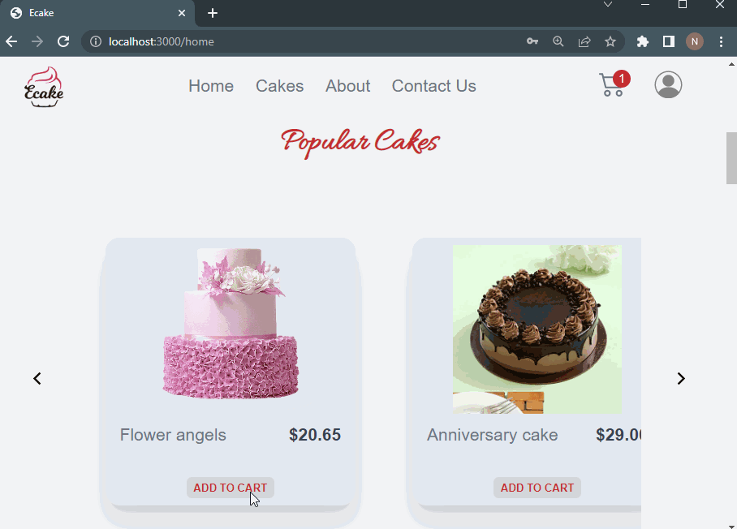

# Ecake ecommerce shop

An online shopping website project


git

### INSTRUCTIONS TO RUN THIS APP

Clone this repository.

```
https://github.com/norman-chifenga/ecake
```

Create a project with firebase and then add the firebase app config variable 
inside  the file below or alternatively create an .env file then link the variables
to the same folder

```
./src/data/firebase

```

Install dependencies
```
npm install
```

To start the development mode run

```
npm run dev
```
To build the application run
```
npm run build
```